## 1、Spring

### 1.1 简介

Spring : 春天 --->给软件行业带来了春天

2002年，Rod Jahnson首次推出了Spring框架雏形interface21框架。

2004年3月24日，Spring框架以interface21框架为基础，经过重新设计，发布了1.0正式版。

很难想象Rod Johnson的学历 , 他是悉尼大学的博士，然而他的专业不是计算机，而是音乐学。

Spring理念 : 使现有技术更加实用 . 本身就是一个大杂烩 , 整合现有的框架技术

官网 : http://spring.io/

官方下载地址 : https://repo.spring.io/libs-release-local/org/springframework/spring/

GitHub : https://github.com/spring-projects

### 1.2 优点

- Spring是一个开源免费的框架 , 容器  
- Spring是一个轻量级的框架 , 非侵入式的（引入不会对原项目产生影响） 
- **控制反转 IoC  , 面向切面 Aop**
- 对事物的支持 , 对框架的支持

**总结：Spring就是一个轻量级的控制反转（IOC）和面向切面编程（AOP）的框架**

### 1.3 组成 

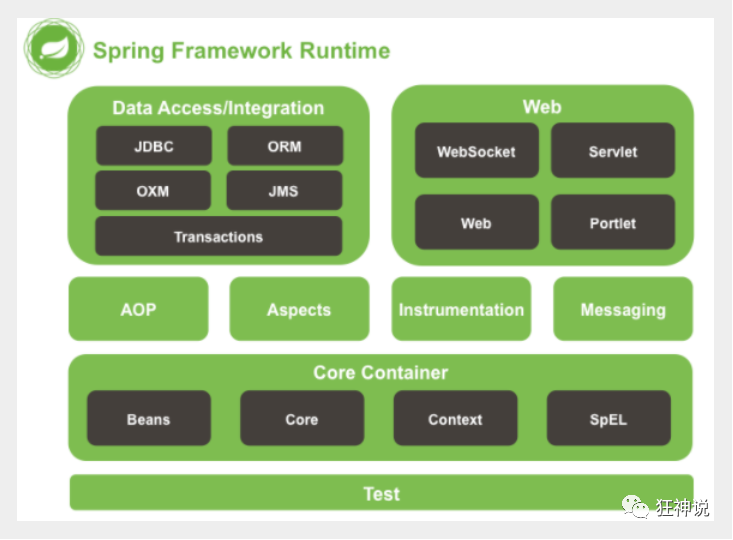

Spring 框架是一个分层架构，由 7 个定义良好的模块组成。Spring 模块构建在核心容器之上，核心容器定义了创建、配置和管理 bean 的方式 。


组成 Spring 框架的每个模块（或组件）都可以单独存在，或者与其他一个或多个模块联合实现。每个模块的功能如下：

- **核心容器**：核心容器提供 Spring 框架的基本功能。核心容器的主要组件是BeanFactory，它是工厂模式的实现。BeanFactory 使用*控制反转*（IOC） 模式将应用程序的配置和依赖性规范与实际的应用程序代码分开。
- **Spring 上下文**：Spring 上下文是一个配置文件，向 Spring 框架提供上下文信息。Spring 上下文包括企业服务，例如 JNDI、EJB、电子邮件、国际化、校验和调度功能。
- **Spring AOP**：通过配置管理特性，Spring AOP 模块直接将面向切面的编程功能 , 集成到了 Spring 框架中。所以，可以很容易地使 Spring 框架管理任何支持 AOP的对象。Spring AOP 模块为基于 Spring 的应用程序中的对象提供了事务管理服务。通过使用 Spring AOP，不用依赖组件，就可以将声明性事务管理集成到应用程序中。
- **Spring DAO**：JDBC DAO 抽象层提供了有意义的异常层次结构，可用该结构来管理异常处理和不同数据库供应商抛出的错误消息。异常层次结构简化了错误处理，并且极大地降低了需要编写的异常代码数量（例如打开和关闭连接）。Spring DAO 的面向 JDBC 的异常遵从通用的 DAO 异常层次结构。
- **Spring ORM**：Spring 框架插入了若干个 ORM 框架，从而提供了 ORM 的对象关系工具，其中包括 JDO、Hibernate 和 iBatis SQL Map。所有这些都遵从 Spring 的通用事务和 DAO 异常层次结构。
- **Spring Web 模块**：Web 上下文模块建立在应用程序上下文模块之上，为基于 Web 的应用程序提供了上下文。所以，Spring 框架支持与 Jakarta Struts 的集成。Web 模块还简化了处理多部分请求以及将请求参数绑定到域对象的工作。
- **Spring MVC 框架**：MVC 框架是一个全功能的构建 Web 应用程序的 MVC 实现。通过策略接口，MVC 框架变成为高度可配置的，MVC 容纳了大量视图技术，其中包括 JSP、Velocity、Tiles、iText 和 POI。

## 2、IOC理论推导

### 2.1推导示例

1、先写一个UserDao接口

```java
public interface UserDao {
   public void getUser();
}
```

2、再去写Dao的实现类

```java
public class UserDaoImpl implements UserDao {
   @Override
   public void getUser() {
       System.out.println("获取用户数据");
  }
}
```

3、然后去写UserService的接口

```java
public interface UserService {
   public void getUser();
}
```

4、最后写Service的实现类

```java
public class UserServiceImpl implements UserService {
   private UserDao userDao = new UserDaoImpl();

   @Override
   public void getUser() {
       userDao.getUser();
  }
}
```

5、测试一下

```java
@Test
public void test(){
   UserService service = new UserServiceImpl();
   service.getUser();
}
```

在这个示例中由于Service中式直接确定了具体的实现类，如果此时UserDao有两个实现类：

```java
public class UserDaoOracleImpl implements UserDao {
   @Override
   public void getUser() {
       System.out.println("Oracle获取用户数据");
  }
}
```

若此时想用UserDaoOracleImpl实现类，可以去修改service的实现类

```java
private UserDao userDao = new UserDaoOracleImpl();
```

但是如果出现大量需要改动，此方式就不适用了，新方法如下：

我们可以在需要用到他的地方 , 不去实现它 , 而是留出一个接口 , 利用set , 我们去代码里修改下 

```java
public class UserServiceImpl implements UserService {
   private UserDao userDao;
// 利用set实现
   public void setUserDao(UserDao userDao) {
       this.userDao = userDao;
  }

   @Override
   public void getUser() {
       userDao.getUser();
  }
}
```

现在去我们的测试类里 , 进行测试 ;

```java
@Test
public void test(){
   UserServiceImpl service = new UserServiceImpl();
   service.setUserDao( new UserDaoImpl() );
   service.getUser();
   //那我们现在又想用Oracle去实现呢
   service.setUserDao( new UserDaoOracleImpl() );
   service.getUser();
}
```

这样的方法已经发生了根本性变化：

以前所有东西都是由程序去进行控制创建 , 而现在是由我们自行控制创建对象 , 把主动权交给了调用者 . 程序不用去管怎么创建,怎么实现了 . 它只负责提供一个接口 .

这种思想 , 从本质上解决了问题 , 我们程序员不再去管理对象的创建了 , 更多的去关注业务的实现 . 耦合性大大降低 . 这也就是IOC的原型 !

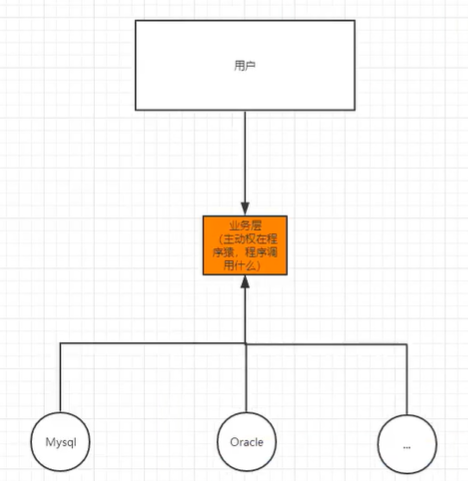

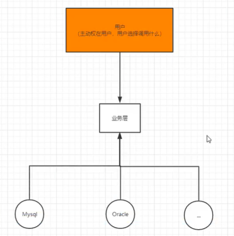

### 2.2 IOC本质

**控制反转IoC(Inversion of Control)，是一种设计思想，DI(依赖注入)是实现IoC的一种方法**，也有人认为DI只是IoC的另一种说法。没有IoC的程序中 , 我们使用面向对象编程 , 对象的创建与对象间的依赖关系完全硬编码在程序中，对象的创建由程序自己控制，控制反转后将对象的创建转移给第三方，个人认为所谓控制反转就是：**获得依赖对象的方式反转了。**

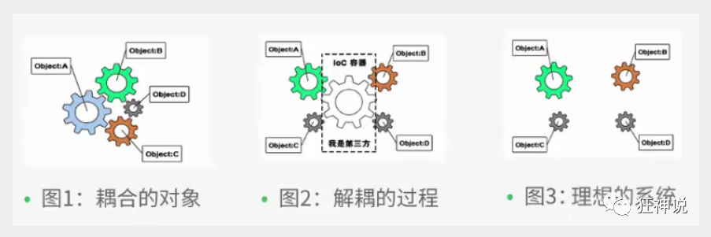

**IoC是Spring框架的核心内容**，使用多种方式完美的实现了IoC，可以使用XML配置，也可以使用注解，新版本的Spring也可以零配置实现IoC。

Spring容器在初始化时先读取配置文件，根据配置文件或元数据创建与组织对象存入容器中，程序使用时再从Ioc容器中取出需要的对象。


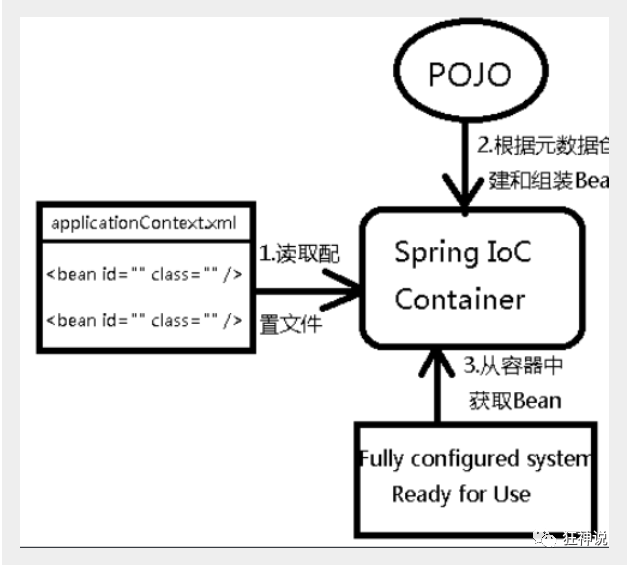

采用XML方式配置Bean的时候，Bean的定义信息是和实现分离的，而采用注解的方式可以把两者合为一体，Bean的定义信息直接以注解的形式定义在实现类中，从而达到了零配置的目的。

**控制反转是一种通过描述（XML或注解）并通过第三方去生产或获取特定对象的方式。在Spring中实现控制反转的是IoC容器，其实现方法是依赖注入（Dependency Injection,DI）。**

举例：

本来有客人来，你写好菜单买好菜，客人来了然后自己炒好菜去招待

IOC：做饭这事 不用由你自己来做 而是找第三方餐厅做了

## 3、HelloSpring

所有的类都要装配到bean中（示例1->2）所有的bean都需要容器去取（解析XML文件） 所有的bean拿出来就是对象 不需要new

1、编写一个Hello实体类

```java
public class Hello {
   private String name;

   public String getName() {
       return name;
  }
   public void setName(String name) {
       this.name = name;
  }

   public void show(){
       System.out.println("Hello,"+ name );
  }
}
```

2、编写我们的spring文件 , 这里我们命名为beans.xml

```xml
<?xml version="1.0" encoding="UTF-8"?>
<beans xmlns="http://www.springframework.org/schema/beans"
      xmlns:xsi="http://www.w3.org/2001/XMLSchema-instance"
      xsi:schemaLocation="http://www.springframework.org/schema/beans
       http://www.springframework.org/schema/beans/spring-beans.xsd">

   <!--bean就是java对象 , 由Spring创建和管理-->
   <bean id="hello" class="com.kuang.pojo.Hello">
       <property name="name" value="Spring"/>
   </bean>

</beans>
```

3、我们可以去进行测试了 .

```java
@Test
public void test(){
   //解析beans.xml文件 , 生成管理相应的Bean对象
   ApplicationContext context = new ClassPathXmlApplicationContext("beans.xml");
   //getBean : 参数即为spring配置文件中bean的id .
   Hello hello = (Hello) context.getBean("hello");
   hello.show();
}
```


> 思考

- Hello 对象是谁创建的 ?  【hello 对象是由Spring创建的
- Hello 对象的属性是怎么设置的 ?  hello 对象的属性是由Spring容器设置的

这个过程就叫控制反转 :

- 控制 : 谁来控制对象的创建 , 传统应用程序的对象是由程序本身控制创建的 , 使用Spring后 , 对象是由Spring来创建的
- 反转 : 程序本身不创建对象 , 而变成被动的接收对象 .

依赖注入 : 就是利用set方法来进行注入的.

 IOC是一种编程思想，由主动的编程变成被动的接收

**修改推导示例**

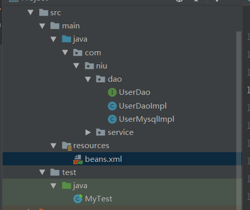

创建beans.xml

```xml
<?xml version="1.0" encoding="UTF-8"?>
<beans xmlns="http://www.springframework.org/schema/beans"
       xmlns:xsi="http://www.w3.org/2001/XMLSchema-instance"
       xsi:schemaLocation="http://www.springframework.org/schema/beans
       http://www.springframework.org/schema/beans/spring-beans.xsd">

    <!--bean就是java对象 , 由Spring创建和管理-->
    <bean id="DaoImpl" class="com.niu.dao.UserDaoImpl"/>
    <bean id="MysqlImpl" class="com.niu.dao.UserMysqlImpl"/>
    <bean id="UserServiceImpl" class="com.niu.service.UserServiceImpl">
        <property name="userDao" ref="MysqlImpl"></property>
        <!--
            ref:引用Spring容器中创建好的对象
            value：具体值，基本数据类型
        -->
    </bean>
</beans>
```

测试类

```java
public class MyTest {
    public static void main(String[] args) {
        ApplicationContext context = new ClassPathXmlApplicationContext("beans.xml");
       UserServiceImpl userServiceImpl = (UserServiceImpl) context.getBean("UserServiceImpl");
        userServiceImpl.getUser();
    }
}
```

OK , 到了现在 , 我们彻底不用再程序中去改动了 , 要实现不同的操作 , 只需要在xml配置文件中进行修改 , 所谓的IoC,一句话搞定 : **对象由Spring 来创建 , 管理 , 装配 !** 

## 4、IOC创建对象得方式

> 通过无参构造方法来创建

1、User.java

```
public class User {

   private String name;

   public User() {
       System.out.println("user无参构造方法");
  }

   public void setName(String name) {
       this.name = name;
  }

   public void show(){
       System.out.println("name="+ name );
  }

}
```

2、beans.xml

```
<?xml version="1.0" encoding="UTF-8"?>
<beans xmlns="http://www.springframework.org/schema/beans"
      xmlns:xsi="http://www.w3.org/2001/XMLSchema-instance"
      xsi:schemaLocation="http://www.springframework.org/schema/beans
       http://www.springframework.org/schema/beans/spring-beans.xsd">

   <bean id="user" class="com.niu.pojo.User">
       <property name="name" value="niu"/>
   </bean>

</beans>
```

3、测试类

```
@Test
public void test(){
   ApplicationContext context = new ClassPathXmlApplicationContext("beans.xml");
   //在执行getBean的时候, user已经创建好了 , 通过无参构造
   User user = (User) context.getBean("user");
   //调用对象的方法 .
   user.show();
}
```

结果可以发现，在调用show方法之前，User对象已经通过无参构造初始化了！


> 通过有参构造方法来创建

1、UserT . java

```java
public class UserT {

   private String name;

   public UserT(String name) {
       this.name = name;
  }

   public void setName(String name) {
       this.name = name;
  }

   public void show(){
       System.out.println("name="+ name );
  }

}
```

2、beans.xml 有三种方式编写

```xml-dtd
<!-- 第一种根据index参数下标设置 -->
<bean id="userT" class="com.niu.pojo.UserT">
   <!-- index指构造方法 , 下标从0开始 -->
   <constructor-arg index="0" value="niu2"/>
</bean>
<!-- 第二种根据参数名字设置 -->
<bean id="userT" class="com.niu.pojo.UserT">
   <!-- name指参数名 -->
   <constructor-arg name="name" value="niu2"/>
</bean>
<!-- 第三种根据参数类型设置 -->
<bean id="userT" class="com.niu.pojo.UserT">
   <constructor-arg type="java.lang.String" value="niu"/>
</bean>
```

3、测试

```java
@Test
public void testT(){
   ApplicationContext context = new ClassPathXmlApplicationContext("beans.xml");
   UserT user = (UserT) context.getBean("userT");
   user.show();
}
```

结论：在配置文件加载的时候。其中管理的对象都已经初始化了！

## 5、Spring配置

### 5.1 别名

alias 设置别名 , 为bean设置别名 , 可以设置多个别名

```xml
<!--设置别名：在获取Bean的时候可以使用别名获取-->
<alias name="user" alias="userNew"/>
```

### 5.2 Bean的配置

```xml
<!--bean就是java对象,由Spring创建和管理-->

<!--
   id 是bean的标识符,要唯一,如果没有配置id,name就是默认标识符
   如果配置id,又配置了name,那么name是别名
   name可以设置多个别名,可以用逗号,分号,空格隔开
   如果不配置id和name,可以根据applicationContext.getBean(.class)获取对象;

class是bean的全限定名=包名+类名
-->
<bean id="hello" name="hello2 h2,h3;h4" class="com.kuang.pojo.Hello">
   <property name="name" value="Spring"/>
</bean>
```

### 5.3 import

团队的合作通过import来实现 .

```xml
<import resource="{path}/beans.xml"/>
```

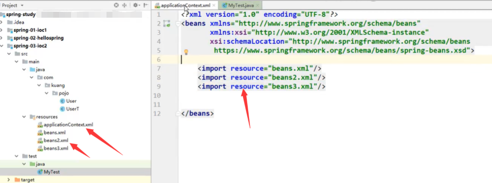

## 6、DI（依赖注入）

### 6.1 构造器注入

### 6.2 set方式注入（重点）

- 依赖注入（Dependency Injection,DI）。
- 依赖 : 指Bean对象的创建依赖于容器 . Bean对象的依赖资源 .
- 注入 : 指Bean对象所依赖的资源 , 由容器来设置和装配 .

【环境搭建】

创建

```
public class Address {
    private String address;

    @Override
    public String toString() {
        return "Address{" +
                "address='" + address + '\'' +
                '}';
    }

    public String getAddress() {
        return address;
    }

    public void setAddress(String address) {
        this.address = address;
    }
}
```

```
public class Student {
    private String name;
    private Address address;
    private String[] books;
    private List<String> hobbys;
    private Map<String,String> card;
    private Set<String> games;
    private String wife;
    private Properties info;
    
    get/set/toString
}
```

```xml
<?xml version="1.0" encoding="UTF-8"?>
<beans xmlns="http://www.springframework.org/schema/beans"
       xmlns:xsi="http://www.w3.org/2001/XMLSchema-instance"
       xsi:schemaLocation="http://www.springframework.org/schema/beans
       http://www.springframework.org/schema/beans/spring-beans.xsd">
    <bean id="addr" class="com.niu.pojo.Address">
        <property name="address" value="郑州"/>
    </bean>
    <!--bean就是java对象 , 由Spring创建和管理-->
    <bean id="student" class="com.niu.pojo.Student">
        <!--第一种：普通注入 value-->
        <property name="name" value="牛牛"/>
        <!--第二种：ref-->
        <property name="address" ref="addr"/>
        <!--第三种：数组注入-->
        <property name="books">
            <array>
                <value>西游记</value>
                <value>红楼梦</value>
                <value>水浒传</value>
            </array>
        </property>
        <!--第四种：List注入-->
        <property name="hobbys">
            <list>
                <value>听歌</value>
                <value>看电影</value>
                <value>爬山</value>
            </list>
        </property>
        <!--第五种：Map注入-->
        <property name="card">
            <map>
                <entry key="中国邮政" value="456456456465456"/>
                <entry key="建设" value="1456682255511"/>
            </map>
        </property>
        <!--第六种：Set注入-->
        <property name="games">
            <set>
                <value>LOL</value>
                <value>BOB</value>
                <value>COC</value>
            </set>
        </property>
        <!--第七种：null注入-->
        <property name="wife"><null/></property>
        <!--第八种：Properties注入-->
        <property name="info">
            <props>
                <prop key="学号">20190604</prop>
                <prop key="性别">男</prop>
                <prop key="姓名">小明</prop>
            </props>
        </property>
    </bean>
</beans>
```

测试

```java
public class MyTest {
    public static void main(String[] args) {
        ClassPathXmlApplicationContext applicationContext = new ClassPathXmlApplicationContext("beans.xml");
        Student student = (Student) applicationContext.getBean("student");
        System.out.println(student.toString());
    }
}
```

结果：

```
Student{name='牛牛', address=Address{address='郑州'},
books=[西游记, 红楼梦, 水浒传], hobbys=[听歌, 看电影, 爬山], 
card={中国邮政=456456456465456, 建设=1456682255511}, games=[LOL, BOB, COC], 
wife='null', info={学号=20190604, 性别=男, 姓名=小明}}
```

### 6.3 拓展方式注入


### 6.4 bean作用域

在Spring中，那些组成应用程序的主体及由Spring IoC容器所管理的对象，被称之为bean。简单地讲，bean就是由IoC容器初始化、装配及管理的对象 .

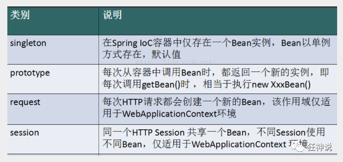

几种作用域中，request、session作用域仅在基于web的应用中使用（不必关心你所采用的是什么web应用框架），只能用在基于web的Spring ApplicationContext环境。

**Singleton**

当一个bean的作用域为Singleton，那么Spring IoC容器中只会存在一个共享的bean实例，并且所有对bean的请求，只要id与该bean定义相匹配，则只会返回bean的同一实例。Singleton是单例类型，就是在创建起容器时就同时自动创建了一个bean的对象，不管你是否使用，他都存在了，每次获取到的对象都是同一个对象。注意，Singleton作用域是Spring中的缺省作用域。要在XML中将bean定义成singleton，可以这样配置：

```xml
 <bean id="ServiceImpl" class="cn.niu.service.ServiceImpl" scope="singleton">
```

测试：

```java
 @Test
 public void test03(){
     ApplicationContext context = newClassPathXmlApplicationContext("applicationContext.xml");
     User user = (User) context.getBean("user");
     User user2 = (User) context.getBean("user");
     System.out.println(user==user2);
 }

输出结果true
```

**Prototype**

当一个bean的作用域为Prototype，表示一个bean定义对应多个对象实例。Prototype作用域的bean会导致在每次对该bean请求（将其注入到另一个bean中，或者以程序的方式调用容器的getBean()方法）时都会创建一个新的bean实例。Prototype是原型类型，它在我们创建容器的时候并没有实例化，而是当我们获取bean的时候才会去创建一个对象，而且我们每次获取到的对象都不是同一个对象。根据经验，对有状态的bean应该使用prototype作用域，而对无状态的bean则应该使用singleton作用域。在XML中将bean定义成prototype，可以这样配置：

```xml
 <bean id="account" class="com.foo.DefaultAccount" scope="prototype"/>  
  或者
 <bean id="account" class="com.foo.DefaultAccount" singleton="false"/>
```

**Request**

当一个bean的作用域为Request，表示在一次HTTP请求中，一个bean定义对应一个实例；即每个HTTP请求都会有各自的bean实例，它们依据某个bean定义创建而成。该作用域仅在基于web的Spring ApplicationContext情形下有效。考虑下面bean定义：

```xml
 <bean id="loginAction" class=cn.niu.LoginAction" scope="request"/>
```

针对每次HTTP请求，Spring容器会根据loginAction bean的定义创建一个全新的LoginAction bean实例，且该loginAction bean实例仅在当前HTTP request内有效，因此可以根据需要放心的更改所建实例的内部状态，而其他请求中根据loginAction bean定义创建的实例，将不会看到这些特定于某个请求的状态变化。当处理请求结束，request作用域的bean实例将被销毁。

**Session**

当一个bean的作用域为Session，表示在一个HTTP Session中，一个bean定义对应一个实例。该作用域仅在基于web的Spring ApplicationContext情形下有效。考虑下面bean定义：

```xml
 <bean id="userPreferences" class="com.niu.UserPreferences" scope="session"/>
```

针对某个HTTP Session，Spring容器会根据userPreferences bean定义创建一个全新的userPreferences bean实例，且该userPreferences bean仅在当前HTTP Session内有效。与request作用域一样，可以根据需要放心的更改所创建实例的内部状态，而别的HTTP Session中根据userPreferences创建的实例，将不会看到这些特定于某个HTTP Session的状态变化。当HTTP Session最终被废弃的时候，在该HTTP Session作用域内的bean也会被废弃掉。

## 7、bean自动装配

### 7.1测试环境搭建

1、新建一个项目

2、新建两个实体类，Cat  Dog  都有一个叫的方法

```java
public class Cat {
   public void shout() {
       System.out.println("miao~");
  }
}
public class Dog {
   public void shout() {
       System.out.println("wang~");
  }
}
```

3、新建一个用户类 User

```java
public class User {
   private Cat cat;
   private Dog dog;
   private String name;
   get/set/toString
}
```

4、编写Spring配置文件

```xml
<?xml version="1.0" encoding="UTF-8"?>
<beans xmlns="http://www.springframework.org/schema/beans"
      xmlns:xsi="http://www.w3.org/2001/XMLSchema-instance"
      xsi:schemaLocation="http://www.springframework.org/schema/beans
       http://www.springframework.org/schema/beans/spring-beans.xsd">

   <bean id="dog" class="com.niu.pojo.Dog"/>
   <bean id="cat" class="com.niu.pojo.Cat"/>

   <bean id="user" class="com.niu.pojo.User">
       <property name="cat" ref="cat"/>
       <property name="dog" ref="dog"/>
       <property name="str" value="牛二"/>
   </bean>
</beans>
```

5、测试

```java
public class MyTest {
   @Test
   public void testMethodAutowire() {
       ApplicationContext context = newClassPathXmlApplicationContext("beans.xml");
       User user = (User) context.getBean("user");
       user.getCat().shout();
       user.getDog().shout();
  }
}
```

结果正常输出，环境OK


### 7.2 byName

**autowire  byName (按名称自动装配)**

由于在手动配置xml过程中，常常发生字母缺漏和大小写等错误，而无法对其进行检查，使得开发效率降低。

采用自动装配将避免这些错误，并且使配置简单化。

测试：

1、修改bean配置，增加一个属性  autowire="byName"

```xml
<bean id="user" class="com.niu.pojo.User" autowire="byName">
   <property name="str" value="牛二"/>
</bean>
```

2、再次测试，结果依旧成功输出！

3、我们将 cat 的bean id修改为 catXXX

4、再次测试， 执行时报空指针java.lang.NullPointerException。因为按byName规则找不对应set方法，真正的setCat就没执行，对象就没有初始化，所以调用时就会报空指针错误。

**小结：**

当一个bean节点带有 autowire byName的属性时。

1. 将查找其类中所有的set方法名，例如setCat，获得将set去掉并且首字母小写的字符串，即cat。

2. 去spring容器中寻找是否有此字符串名称id的对象。

3. 如果有，就取出注入；如果没有，就报空指针异常。

   

### 7.3 byType

**autowire byType (按类型自动装配)**

使用autowire byType首先需要保证：同一类型的对象，在spring容器中唯一。如果不唯一，会报不唯一的异常。

```xml
NoUniqueBeanDefinitionException
```

测试：

1、将user的bean配置修改一下 ： autowire="byType"

2、测试，正常输出

3、在注册一个cat 的bean对象！

```xml
<bean id="dog" class="com.niu.pojo.Dog"/>
<bean id="cat" class="com.niu.pojo.Cat"/>
<bean id="cat2" class="com.niu.pojo.Cat"/>

<bean id="user" class="com.niu.pojo.User" autowire="byType">
   <property name="str" value="牛二"/>
</bean>
```

4、测试，报错：NoUniqueBeanDefinitionException

5、删掉cat2，将cat的bean名称改掉！测试！因为是按类型装配，所以并不会报异常，也不影响最后的结果。甚至将id属性去掉，也不影响结果。

这就是按照类型自动装配！

### 7.4 自动装备注解开发

准备工作：利用注解的方式注入属性。

在spring配置文件中引入context文件头并开启注解

```xml
<?xml version="1.0" encoding="UTF-8"?>
<beans xmlns="http://www.springframework.org/schema/beans"
       xmlns:xsi="http://www.w3.org/2001/XMLSchema-instance"
       xmlns:context="http://www.springframework.org/schema/context"
       xsi:schemaLocation="http://www.springframework.org/schema/beans
        https://www.springframework.org/schema/beans/spring-beans.xsd
        http://www.springframework.org/schema/context
        https://www.springframework.org/schema/context/spring-context.xsd">
    <!--开启注解-->
    <context:annotation-config/>
    <bean id="cat" class="com.niu.pojo.Cat"/>
    <bean id="dog" class="com.niu.pojo.Dog"/>
    <bean id="people" class="com.niu.pojo.People"/>
</beans>
```

**@Autowired**

- @Autowired是按类型自动转配的，不支持id匹配。
- 需要导入 spring-aop的包！

测试：

1、将User类中的set方法去掉，使用@Autowired注解

```Java
public class User {
   @Autowired
   private Cat cat;
   @Autowired
   private Dog dog;
   private String str;

   public Cat getCat() {
       return cat;
  }
   public Dog getDog() {
       return dog;
  }
   public String getStr() {
       return str;
  }
}
```

2、此时配置文件内容

```xml
<context:annotation-config/>

<bean id="dog" class="com.niu.pojo.Dog"/>
<bean id="cat" class="com.niu.pojo.Cat"/>
<bean id="user" class="com.niu.pojo.People"/>
```

3、测试，成功输出结果！

【科普时间】

@Autowired(required=false)  说明：false，对象可以为null；true，对象必须存对象，不能为null。

```Java
//如果允许对象为null，设置required = false,默认为true
@Autowired(required = false)
private Cat cat;
```

**@Qualifier**

- @Autowired是根据类型自动装配的，加上@Qualifier则可以根据byName的方式自动装配
- @Qualifier不能单独使用。

测试实验步骤：

1、配置文件修改内容，保证类型存在对象。且名字不为类的默认名字！

```xml
<bean id="dog1" class="com.niu.pojo.Dog"/>
<bean id="dog2" class="com.niu.pojo.Dog"/>
<bean id="cat1" class="com.niu.pojo.Cat"/>
<bean id="cat2" class="com.niu.pojo.Cat"/>
```

2、没有加Qualifier测试，直接报错

3、在属性上添加Qualifier注解

```Java
@Autowired
@Qualifier(value = "cat2")
private Cat cat;
@Autowired
@Qualifier(value = "dog2")
private Dog dog;
```

测试，成功输出

**@Resource**

- @Resource如有指定的name属性，先按该属性进行byName方式查找装配；
- 其次再进行默认的byName方式进行装配；
- 如果以上都不成功，则按byType的方式自动装配。
- 都不成功，则报异常。

实体类：

```
public class People {
   //如果允许对象为null，设置required = false,默认为true
   @Resource(name = "cat2")
   private Cat cat;
   @Resource
   private Dog dog;
   private String name;
}
```

beans.xml

```
<bean id="dog" class="com.niu.pojo.Dog"/>
<bean id="cat1" class="com.niu.pojo.Cat"/>
<bean id="cat2" class="com.niu.pojo.Cat"/>

<bean id="user" class="com.niu.pojo.User"/>
```

测试：结果OK

配置文件2：beans.xml ， 删掉cat2

```
<bean id="dog" class="com.niu.pojo.Dog"/>
<bean id="cat1" class="com.niu.pojo.Cat"/>
```

实体类上只保留注解

```
@Resource
private Cat cat;
@Resource
private Dog dog;
```

结果：OK

结论：先进行byName查找，失败；再进行byType查找，成功。

**小结**

@Autowired与@Resource异同：

1、@Autowired与@Resource都可以用来装配bean。都可以写在字段上，或写在setter方法上。

2、@Autowired默认按类型装配（属于spring规范），默认情况下必须要求依赖对象必须存在，如果要允许null 值，可以设置它的required属性为false，如：@Autowired(required=false) ，如果我们想使用名称装配可以结合@Qualifier注解进行使用

3、@Resource（属于J2EE复返），默认按照名称进行装配，名称可以通过name属性进行指定。如果没有指定name属性，当注解写在字段上时，默认取字段名进行按照名称查找，如果注解写在setter方法上默认取属性名进行装配。当找不到与名称匹配的bean时才按照类型进行装配。但是需要注意的是，如果name属性一旦指定，就只会按照名称进行装配。

它们的作用相同都是用注解方式注入对象，但执行顺序不同。@Autowired先byType，@Resource先byName。

## 8、使用注解开发（注解注册bean）

### 8.1 Component

1、配置扫描哪些包下的注解

```xml
<?xml version="1.0" encoding="UTF-8"?>
<beans xmlns="http://www.springframework.org/schema/beans"
       xmlns:xsi="http://www.w3.org/2001/XMLSchema-instance"
       xmlns:context="http://www.springframework.org/schema/context"
       xsi:schemaLocation="http://www.springframework.org/schema/beans
        https://www.springframework.org/schema/beans/spring-beans.xsd
        http://www.springframework.org/schema/context
        https://www.springframework.org/schema/context/spring-context.xsd">
    <!--开启注解-->
    <context:annotation-config/>
    <!--开启扫描-->
    <context:component-scan base-package="com.niu.pojo"/>
</beans>
```

2、在指定包下编写类，增加注解

```java
@Component("user")
// 相当于配置文件中 <bean id="user" class="当前注解的类"/>
public class User {
   public String name = "牛二";
}
```

3、测试

```Java
@Test
public void test(){
   ApplicationContext applicationContext =
       new ClassPathXmlApplicationContext("applicationContext.xml");
   User user = (User) applicationContext.getBean("user");
   System.out.println(user.name);
}
```

### 8.2 属性注入

使用注解注入属性

1、可以不用提供set方法，直接在直接名上添加@value("值")

```
@Component("user")
// 相当于配置文件中 <bean id="user" class="当前注解的类"/>
public class User {
   @Value("牛二")
   // 相当于配置文件中 <property name="name" value="牛二"/>
   public String name;
}
```

2、如果提供了set方法，在set方法上添加@value("值");

```
@Component("user")
public class User {

   public String name;

   @Value("牛二")
   public void setName(String name) {
       this.name = name;
  }
}
```


> 衍生注解

我们这些注解，就是替代了在配置文件当中配置步骤而已！更加的方便快捷！

**@Component三个衍生注解**

为了更好的进行分层，Spring可以使用其它三个注解，功能一样，目前使用哪一个功能都一样。

- @Controller：web层
- @Service：service层
- @Repository：dao层

写上这些注解，就相当于将这个类交给Spring管理装配了！

> 自动装配注解

在Bean的自动装配已经讲过了，可以回顾！

> 作用域

@scope

- singleton：默认的，Spring会采用单例模式创建这个对象。关闭工厂 ，所有的对象都会销毁。
- prototype：多例模式。关闭工厂 ，所有的对象不会销毁。内部的垃圾回收机制会回收

```
@Controller("user")
@Scope("prototype")
public class User {
   @Value("牛二")
   public String name;
}
```


> 小结

**XML与注解比较**

- XML可以适用任何场景 ，结构清晰，维护方便
- 注解不是自己提供的类使用不了，开发简单方便

**xml与注解整合开发** ：推荐最佳实践

- xml管理Bean
- 注解完成属性注入
- 使用过程中， 可以不用扫描，扫描是为了类上的注解

```
<context:annotation-config/>  
```

作用：

- 进行注解驱动注册，从而使注解生效
- 用于激活那些已经在spring容器里注册过的bean上面的注解，也就是显示的向Spring注册
- 如果不扫描包，就需要手动配置bean
- 如果不加注解驱动，则注入的值为null！

## 9 、基于Java类进行配置

JavaConfig 原来是 Spring 的一个子项目，它通过 Java 类的方式提供 Bean 的定义信息，在 Spring4 的版本， JavaConfig 已正式成为 Spring4 的核心功能 。

测试：

1、编写一个实体类，Dog

```java
@Component  //将这个类标注为Spring的一个组件，放到容器中！
public class Dog {
   public String name = "dog";
}
```

2、新建一个config配置包，编写一个MyConfig配置类

```java
@Configuration  //代表这是一个配置类，和之前beans.xml类似
public class MyConfig {

   @Bean //通过方法注册一个bean，这里的返回值就Bean的类型，方法名就是bean的id！
   public Dog dog(){
       return new Dog();
  }

}
```

3、测试

```java
@Test
public void test2(){
   ApplicationContext applicationContext =
           new AnnotationConfigApplicationContext(MyConfig.class);
   Dog dog = (Dog) applicationContext.getBean("dog");
   System.out.println(dog.name);
}
```

4、成功输出结果！

**导入其他配置如何做呢？**

1、我们再编写一个配置类！

```java
@Configuration  //代表这是一个配置类，和之前beans.xml类似
public class MyConfig2 {
}
```

2、在之前的配置类中我们来选择导入这个配置类

```java
@Configuration
@Import(MyConfig2.class)  //导入合并其他配置类，类似于配置文件中的 inculde 标签
public class MyConfig {

   @Bean
   public Dog dog(){
       return new Dog();
  }
}
```

关于这种Java类的配置方式，我们在之后的SpringBoot 和 SpringCloud中还会大量看到，我们需要知道这些注解的作用即可！

## 10、代理模式


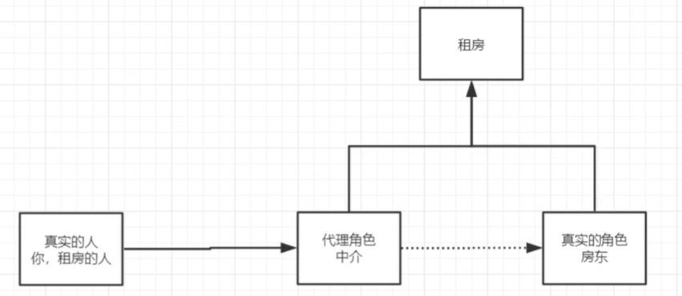

### 10.1 静态代理

角色分析：

- 抽象角色：一般会使用接口或者抽象类来解决
- 真实角色：被代理的角色
- 代理角色：代理真实角色，代理真是角色后，我们一般会做一些附属操作
- 客户：访问代理对象的人。

代码步骤：

1.接口

```java
//租房
public interface Rent {
    void rent();
}
```

2.真实角色

```java
//房东
public class FangDong implements Rent {
    @Override
    public void rent() {
        System.out.println("房东租房");
    }
}
```

3.代理角色

```java
public class Proxy implements Rent{
    private FangDong fangDong;

    public Proxy(FangDong fangDong) {
        this.fangDong = fangDong;
    }

    public Proxy() {
    }
    @Override
    public void rent() {
        seeHouse();
        fangDong.rent();
        fare();
        hetong();
    }
    //看房
    public void seeHouse(){
        System.out.println("中介带你去看房");
    }
    //收中介费
    public void fare(){
        System.out.println("收中介费");
    }
    public void hetong(){
        System.out.println("签合同");
    }
}
```

4.客户端访问代理角色

```java
//客户去租房
public class Client {
    public static void main(String[] args) {
        FangDong fangDong = new FangDong();
        Proxy proxy = new Proxy(fangDong);
        proxy.rent();
    }
}
```

代理模式好处：

- 可以是真实角色的操作 更加纯粹，不用去关注公共业务
- 公共也就交给代理角色！实现了业务的分工。
- 公共业务发生扩展的时候，方便集中管理

缺点：

- 一个真实角色就会产生一个代理角色，代码量翻倍，发卡效率变低。

### 10.2 静态代理再理解

1、创建一个抽象角色，比如咋们平时做的用户业务，抽象起来就是增删改查！

```java
//抽象角色：增删改查业务
public interface UserService {
   void add();
   void delete();
   void update();
   void query();
}
```

2、我们需要一个真实对象来完成这些增删改查操作

```java
//真实对象，完成增删改查操作的人
public class UserServiceImpl implements UserService {

   public void add() {
       System.out.println("增加了一个用户");
  }

   public void delete() {
       System.out.println("删除了一个用户");
  }

   public void update() {
       System.out.println("更新了一个用户");
  }

   public void query() {
       System.out.println("查询了一个用户");
  }
}
```

3、需求来了，现在我们需要增加一个日志功能，怎么实现！

- 思路1 ：在实现类上增加代码 【麻烦！】
- 思路2：使用代理来做，能够不改变原来的业务情况下，实现此功能就是最好的了！

4、设置一个代理类来处理日志！代理角色

```java
//代理角色，在这里面增加日志的实现
public class UserServiceProxy implements UserService {
   private UserServiceImpl userService;

   public void setUserService(UserServiceImpl userService) {
       this.userService = userService;
  }

   public void add() {
       log("add");
       userService.add();
  }

   public void delete() {
       log("delete");
       userService.delete();
  }

   public void update() {
       log("update");
       userService.update();
  }

   public void query() {
       log("query");
       userService.query();
  }

   public void log(String msg){
       System.out.println("执行了"+msg+"方法");
  }

}
```

5、测试访问类：

```java
public class Client {
   public static void main(String[] args) {
       //真实业务
       UserServiceImpl userService = new UserServiceImpl();
       //代理类
       UserServiceProxy proxy = new UserServiceProxy();
       //使用代理类实现日志功能！
       proxy.setUserService(userService);

       proxy.add();
  }
}
```

OK，到了现在代理模式大家应该都没有什么问题了，重点大家需要理解其中的思想；

我们在不改变原来的代码的情况下，实现了对原有功能的增强，这是AOP中最核心的思想

聊聊AOP：纵向开发，横向开发


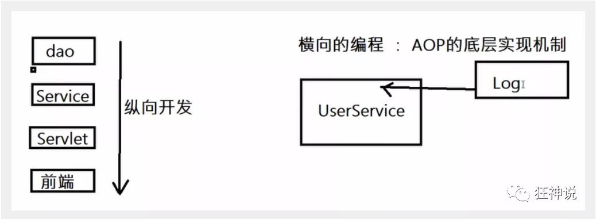

### 10.3 动态代理

- 动态代理和静态代理角色一样

- 动态代理的代理类是动态生成的，不是我们直接写好的

- 动态代理分为两大类：基于接口的动态代理，基于类的动态的动态代理

  ​	基于接口的动态代理----JDK动态代理

  ​	基于类的动态代理--cglib

  ​	现在用的比较多的是 javasist 来生成动态代理 . 百度一下javasist

  ​	我们这里使用JDK的原生代码来实现，其余的道理都是一样的！

**JDK的动态代理需要了解两个类**

核心 : InvocationHandler   和   Proxy  ， 打开JDK帮助文档看看

【InvocationHandler：调用处理程序】 

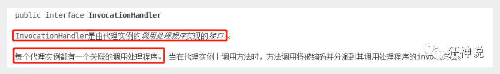

```java
Object invoke(Object proxy, 方法 method, Object[] args)；
//参数
//proxy - 调用该方法的代理实例
//method -所述方法对应于调用代理实例上的接口方法的实例。方法对象的声明类将是该方法声明的接口，它可以是代理类继承该方法的代理接口的超级接口。
//args -包含的方法调用传递代理实例的参数值的对象的阵列，或null如果接口方法没有参数。原始类型的参数包含在适当的原始包装器类的实例中，例如java.lang.Integer或java.lang.Boolean 。
```

【Proxy  : 代理】


**代码实现**

一个通用的动态代理实现的类！所有的代理对象设置为Object即可！

```java
public class ProxyInvocationHandler implements InvocationHandler {
   private Object target;

   public void setTarget(Object target) {
       this.target = target;
  }

   //生成代理类
   public Object getProxy(){
       return Proxy.newProxyInstance(this.getClass().getClassLoader(),
               target.getClass().getInterfaces(),this);
  }

   // proxy : 代理类
   // method : 代理类的调用处理程序的方法对象.
   public Object invoke(Object proxy, Method method, Object[] args) throwsThrowable {
       log(method.getName());
       Object result = method.invoke(target, args);
       return result;
  }

   public void log(String methodName){
       System.out.println("执行了"+methodName+"方法");
  }

}
```

测试！

```java
public class Test {
   public static void main(String[] args) {
       //真实对象
       UserServiceImpl userService = new UserServiceImpl();
       //代理对象的调用处理程序
       ProxyInvocationHandler pih = new ProxyInvocationHandler();
       pih.setTarget(userService); //设置要代理的对象
       UserService proxy = (UserService)pih.getProxy(); //动态生成代理类！
       proxy.delete();
  }
}
```

测试，增删改查，查看结果！

**动态代理的好处**

静态代理有的它都有，静态代理没有的，它也有！

- 可以使得我们的真实角色更加纯粹 . 不再去关注一些公共的事情 .
- 公共的业务由代理来完成 . 实现了业务的分工 ,
- 公共业务发生扩展时变得更加集中和方便 .
- 一个动态代理 , 一般代理某一类业务
- 一个动态代理可以代理多个类，代理的是接口！

## 11、AOP

### 11.1 什么是AOP

AOP（Aspect Oriented Programming）意为：面向切面编程，通过预编译方式和运行期动态代理实现程序功能的统一维护的一种技术。AOP是OOP的延续，是软件开发中的一个热点，也是Spring框架中的一个重要内容，是函数式编程的一种衍生范型。利用AOP可以对业务逻辑的各个部分进行隔离，从而使得业务逻辑各部分之间的耦合度降低，提高程序的可重用性，同时提高了开发的效率。

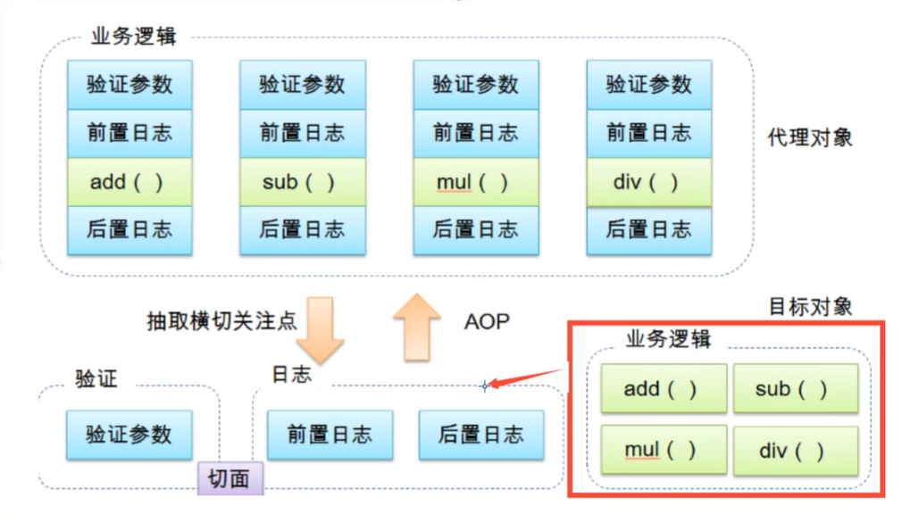

### 11.2 AOP在Spring中的作用

提供声明式事务；允许用户自定义切面

以下名词需要了解下：

- 横切关注点：跨越应用程序多个模块的方法或功能。即是，与我们业务逻辑无关的，但是我们需要关注的部分，就是横切关注点。如日志 , 安全 , 缓存 , 事务等等 ....
- 切面（ASPECT）：横切关注点 被模块化 的特殊对象。即，它是一个类。比如日志类 Log
- 通知（Advice）：切面必须要完成的工作。即，它是类中的一个方法。 比如 Log中的前置通知方法
- 目标（Target）：被通知对象。
- 代理（Proxy）：向目标对象应用通知之后创建的对象。
- 切入点（PointCut）：切面通知 执行的 “地点”的定义。 
- 连接点（JointPoint）：与切入点匹配的执行点。


SpringAOP中，通过Advice定义横切逻辑，Spring中支持5种类型的Advice:


即 Aop 在 不改变原有代码的情况下 , 去增加新的功能 .

### 11.3使用Spring实现aop

使用AOP织入，需要导入一个依赖包

```xml
<dependency>
    <groupId>org.aspectj</groupId>
    <artifactId>aspectjweaver</artifactId>
    <version>1.9.5</version>
</dependency>
```

**第一种实现方式----通过API实现**

首先编写我们的业务接口和实现类

```java
public interface UserService {

   void add();
   void delete();
   void update();
   void search();

}
```


```java
public class UserServiceImpl implements UserService{

   @Override
   public void add() {
       System.out.println("增加用户");
  }

   @Override
   public void delete() {
       System.out.println("删除用户");
  }

   @Override
   public void update() {
       System.out.println("更新用户");
  }

   @Override
   public void search() {
       System.out.println("查询用户");
  }
}
```

然后去写我们的增强类 , 我们编写两个 , 一个前置增强 一个后置增强

```java
public class Log implements MethodBeforeAdvice {

   //method : 要执行的目标对象的方法
   //objects : 被调用的方法的参数
   //Object : 目标对象
   @Override
   public void before(Method method, Object[] objects, Object o) throws Throwable {
       System.out.println( o.getClass().getName() + "的" + method.getName() + "方法被执行了");
  }
}
```


```java
public class AfterLog implements AfterReturningAdvice {
   //returnValue 返回值
   //method被调用的方法
   //args 被调用的方法的对象的参数
   //target 被调用的目标对象
   @Override
   public void afterReturning(Object returnValue, Method method, Object[] args,Object target) throws Throwable {
       System.out.println("执行了" + target.getClass().getName()
       +"的"+method.getName()+"方法,"
       +"返回值："+returnValue);
  }
}
```

最后去spring的文件中注册 , 并实现aop切入实现 , 注意导入约束 .

```xml
<?xml version="1.0" encoding="UTF-8"?>
<beans xmlns="http://www.springframework.org/schema/beans"
      xmlns:xsi="http://www.w3.org/2001/XMLSchema-instance"
      xmlns:aop="http://www.springframework.org/schema/aop"
      xsi:schemaLocation="http://www.springframework.org/schema/beans
       http://www.springframework.org/schema/beans/spring-beans.xsd
       http://www.springframework.org/schema/aop
       http://www.springframework.org/schema/aop/spring-aop.xsd">

   <!--注册bean-->
   <bean id="userService" class="com.niu.service.UserServiceImpl"/>
   <bean id="log" class="com.niu.log.Log"/>
   <bean id="afterLog" class="com.niu.log.AfterLog"/>

   <!--aop的配置-->
   <aop:config>
       <!--切入点 expression:表达式匹配要执行的方法-->
       <aop:pointcut id="pointcut" expression="execution(* com.niu.service.UserServiceImpl.*(..))"/>
       <!--执行环绕; advice-ref执行方法 . pointcut-ref切入点-->
       <aop:advisor advice-ref="log" pointcut-ref="pointcut"/>
       <aop:advisor advice-ref="afterLog" pointcut-ref="pointcut"/>
   </aop:config>

</beans>
```

测试

```java
public class MyTest {
   @Test
   public void test(){
       ApplicationContext context = newClassPathXmlApplicationContext("beans.xml");
       //动态代理 代理得时接口（* 所以下面返回Uservice接口对象）
       UserService userService = (UserService) context.getBean("userService");
       userService.search();
  }
}
```

Aop的重要性 : 很重要 . 一定要理解其中的思路 , 主要是思想的理解这一块 .

Spring的Aop就是将公共的业务 (日志 , 安全等) 和领域业务结合起来 , 当执行领域业务时 , 将会把公共业务加进来 . 实现公共业务的重复利用 . 领域业务更纯粹 , 程序猿专注领域业务 , 其本质还是动态代理 . 

**第二种方式**

**自定义类来实现Aop**

目标业务类不变依旧是userServiceImpl

第一步 : 写我们自己的一个切入类

```java
public class DiyPointcut {

   public void before(){
       System.out.println("---------方法执行前---------");
  }
   public void after(){
       System.out.println("---------方法执行后---------");
  }
   
}
```

去spring中配置

```java
<!--第二种方式自定义实现-->
<!--注册bean-->
<bean id="diy" class="com.niu.config.DiyPointcut"/>

<!--aop的配置-->
<aop:config>
   <!--第二种方式：使用AOP的标签实现-->
   <aop:aspect ref="diy">
       <aop:pointcut id="diyPonitcut" expression="execution(* com.niu.service.UserServiceImpl.*(..))"/>
       <aop:before pointcut-ref="diyPonitcut" method="before"/>
       <aop:after pointcut-ref="diyPonitcut" method="after"/>
   </aop:aspect>
</aop:config>
```

测试：

```java
public class MyTest {
   @Test
   public void test(){
       ApplicationContext context = newClassPathXmlApplicationContext("beans.xml");
       UserService userService = (UserService) context.getBean("userService");
       userService.add();
  }
}
```


**第三种方式**

**使用注解实现**

第一步：编写一个注解实现的增强类

```java
package com.kuang.config;

import org.aspectj.lang.ProceedingJoinPoint;
import org.aspectj.lang.annotation.After;
import org.aspectj.lang.annotation.Around;
import org.aspectj.lang.annotation.Aspect;
import org.aspectj.lang.annotation.Before;

@Aspect
public class AnnotationPointcut {
   @Before("execution(* com.niu.service.UserServiceImpl.*(..))")
   public void before(){
       System.out.println("---------方法执行前---------");
  }

   @After("execution(* com.niu.service.UserServiceImpl.*(..))")
   public void after(){
       System.out.println("---------方法执行后---------");
  }

   @Around("execution(* com.niu.service.UserServiceImpl.*(..))")
   public void around(ProceedingJoinPoint jp) throws Throwable {
       System.out.println("环绕前");
       System.out.println("签名:"+jp.getSignature());
       //执行目标方法proceed
       Object proceed = jp.proceed();
       System.out.println("环绕后");
       System.out.println(proceed);
  }
}
```

第二步：在Spring配置文件中，注册bean，并增加支持注解的配置

```xml
<!--第三种方式:注解实现-->
<bean id="annotationPointcut" class="com.niu.config.AnnotationPointcut"/>
<aop:aspectj-autoproxy/>
```

aop:aspectj-autoproxy：说明

```
通过aop命名空间的<aop:aspectj-autoproxy />声明自动为spring容器中那些配置@aspectJ切面的bean创建代理，织入切面。当然，spring 在内部依旧采用AnnotationAwareAspectJAutoProxyCreator进行自动代理的创建工作，但具体实现的细节已经被<aop:aspectj-autoproxy />隐藏起来了

<aop:aspectj-autoproxy />有一个proxy-target-class属性，默认为false，表示使用jdk动态代理织入增强，当配为<aop:aspectj-autoproxy  poxy-target-class="true"/>时，表示使用CGLib动态代理技术织入增强。不过即使proxy-target-class设置为false，如果目标类没有声明接口，则spring将自动使用CGLib动态代理。
```

## 12、整合MyBatis

步骤：

1.导入相关jar包

- junit
- mybatis
- mysql
- spring
- aop
- mybatis-spring

### 12.1 回忆创建mybatis

1.创建实体类

2.编写核心配置文件（mybatis-config.xml并绑定接口）

3.编写接口（mapper.class，方法）

4.编写mapper.xml（编写sql语句）

5.测试

### 12.2 MyBatis-Spring

**整合方式一**

1、引入Spring配置文件beans.xml

```xml
<?xml version="1.0" encoding="UTF-8"?>
<beans xmlns="http://www.springframework.org/schema/beans"
      xmlns:xsi="http://www.w3.org/2001/XMLSchema-instance"
      xsi:schemaLocation="http://www.springframework.org/schema/beans
       http://www.springframework.org/schema/beans/spring-beans.xsd">
```

2、配置数据源替换mybaits的数据源

```xml
<!--配置数据源：数据源有非常多，可以使用第三方的，也可使使用Spring的-->
<bean id="dataSource"class="org.springframework.jdbc.datasource.DriverManagerDataSource">
   <property name="driverClassName" value="com.mysql.jdbc.Driver"/>
   <property name="url" value="jdbc:mysql://localhost:3306/mybatis?useSSL=true&amp;useUnicode=true&amp;characterEncoding=utf8"/>
   <property name="username" value="root"/>
   <property name="password" value="123456"/>
</bean>
```

3、配置SqlSessionFactory，关联MyBatis

```xml
<!--配置SqlSessionFactory-->
 <bean id="sqlSessionFactory" class="org.mybatis.spring.SqlSessionFactoryBean">
        <property name="dataSource" ref="dataSource" />
        <!--        绑定MyBatis配置文件-->
        <property name="configLocation" value="mybatis-config.xml"/>
        <property name="mapperLocations" value="classpath:Mapper/*.xml"/>
    </bean>
```

4、注册sqlSessionTemplate，关联sqlSessionFactory；

```xml
<!--注册sqlSessionTemplate , 关联sqlSessionFactory-->
<bean id="sqlSession" class="org.mybatis.spring.SqlSessionTemplate">
   <!--利用构造器注入-->
   <constructor-arg index="0" ref="sqlSessionFactory"/>
</bean>
```

5、增加Dao接口的实现类；私有化sqlSessionTemplate

```java
public class UserDaoImpl implements UserMapper {

   //sqlSession不用我们自己创建了，Spring来管理
   private SqlSessionTemplate sqlSession;

   public void setSqlSession(SqlSessionTemplate sqlSession) {
       this.sqlSession = sqlSession;
  }

   public List<User> selectUser() {
       UserMapper mapper = sqlSession.getMapper(UserMapper.class);
       return mapper.selectUser();
  }
   
}
```

6、注册bean实现

```xml
<bean id="userDao" class="com.niu.dao.UserDaoImpl">
   <property name="sqlSession" ref="sqlSession"/>
</bean>
```

7、测试

```java
   @Test
   public void test2(){
       ApplicationContext context = newClassPathXmlApplicationContext("beans.xml");
       UserMapper mapper = (UserMapper) context.getBean("userDao");
       List<User> user = mapper.selectUser();
       System.out.println(user);
  }
```

**整合方式二**

删除applicationContext.xml中的生成sqlSession片段

1、将我们上面写的UserDaoImpl修改一下

```java
public class UserDaoImpl extends SqlSessionDaoSupport implements UserMapper {
   public List<User> selectUser() {
       UserMapper mapper = getSqlSession().getMapper(UserMapper.class);
       return mapper.selectUser();
  }
}
```

2、修改bean的配置

```xml
<bean id="userDao" class="com.kuang.dao.UserDaoImpl">
   <property name="sqlSessionFactory" ref="sqlSessionFactory" />
</bean>
```

3、测试

```java
@Test
public void test2(){
   ApplicationContext context = new ClassPathXmlApplicationContext("beans.xml");
   UserMapper mapper = (UserMapper) context.getBean("userDao");
   List<User> user = mapper.selectUser();
   System.out.println(user);
}
```

## 13、声明式事务

### 13.1回顾事务

- 事务在项目开发过程非常重要，涉及到数据的一致性的问题，不容马虎！
- 事务管理是企业级应用程序开发中必备技术，用来确保数据的完整性和一致性。

事务就是把一系列的动作当成一个独立的工作单元，这些动作要么全部完成，要么全部不起作用。

**事务四个属性ACID**

1. 原子性（atomicity）

   事务是原子性操作，由一系列动作组成，事务的原子性确保动作要么全部完成，要么完全不起作用

2. 一致性（consistency）

   一旦所有事务动作完成，事务就要被提交。数据和资源处于一种满足业务规则的一致性状态中

3. 隔离性（isolation）

   可能多个事务会同时处理相同的数据，因此每个事务都应该与其他事务隔离开来，防止数据损坏

4. 持久性（durability）

   事务一旦完成，无论系统发生什么错误，结果都不会受到影响。通常情况下，事务的结果被写到持久化存储器中


> #### 测试

将上面的代码拷贝到一个新项目中

在之前的案例中，我们给userDao接口新增两个方法，删除和增加用户；

```
//添加一个用户
int addUser(User user);

//根据id删除用户
int deleteUser(int id);
```

mapper文件，我们故意把 deletes 写错，测试！

```
<insert id="addUser" parameterType="com.kuang.pojo.User">
insert into user (id,name,pwd) values (#{id},#{name},#{pwd})
</insert>

<delete id="deleteUser" parameterType="int">
deletes from user where id = #{id}
</delete>
```

编写接口的实现类，在实现类中，我们去操作一波

```
public class UserDaoImpl extends SqlSessionDaoSupport implements UserMapper {

   //增加一些操作
   public List<User> selectUser() {
       User user = new User(4,"小明","123456");
       UserMapper mapper = getSqlSession().getMapper(UserMapper.class);
       mapper.addUser(user);
       mapper.deleteUser(4);
       return mapper.selectUser();
  }

   //新增
   public int addUser(User user) {
       UserMapper mapper = getSqlSession().getMapper(UserMapper.class);
       return mapper.addUser(user);
  }
   //删除
   public int deleteUser(int id) {
       UserMapper mapper = getSqlSession().getMapper(UserMapper.class);
       return mapper.deleteUser(id);
  }

}
```

测试

```
@Test
public void test2(){
   ApplicationContext context = new ClassPathXmlApplicationContext("beans.xml");
   UserMapper mapper = (UserMapper) context.getBean("userDao");
   List<User> user = mapper.selectUser();
   System.out.println(user);
}
```

报错：sql异常，delete写错了

结果 ：插入成功！

没有进行事务的管理；我们想让他们都成功才成功，有一个失败，就都失败，我们就应该需要**事务！**

以前我们都需要自己手动管理事务，十分麻烦！

但是Spring给我们提供了事务管理，我们只需要配置即可；


> Spring中的事务管理

Spring在不同的事务管理API之上定义了一个抽象层，使得开发人员不必了解底层的事务管理API就可以使用Spring的事务管理机制。Spring支持编程式事务管理和声明式的事务管理。

**编程式事务管理**

- 将事务管理代码嵌到业务方法中来控制事务的提交和回滚
- 缺点：必须在每个事务操作业务逻辑中包含额外的事务管理代码

**声明式事务管理**

- 一般情况下比编程式事务好用。
- 将事务管理代码从业务方法中分离出来，以声明的方式来实现事务管理。
- 将事务管理作为横切关注点，通过aop方法模块化。Spring中通过Spring AOP框架支持声明式事务管理。

**使用Spring管理事务，注意头文件的约束导入 : tx**

```
xmlns:tx="http://www.springframework.org/schema/tx"

http://www.springframework.org/schema/tx
http://www.springframework.org/schema/tx/spring-tx.xsd">
```

**事务管理器**

- 无论使用Spring的哪种事务管理策略（编程式或者声明式）事务管理器都是必须的。
- 就是 Spring的核心事务管理抽象，管理封装了一组独立于技术的方法。

**JDBC事务**

```
<bean id="transactionManager"class="org.springframework.jdbc.datasource.DataSourceTransactionManager">
       <property name="dataSource" ref="dataSource" />
</bean>
```

**配置好事务管理器后我们需要去配置事务的通知**

```
<!--配置事务通知-->
<tx:advice id="txAdvice" transaction-manager="transactionManager">
   <tx:attributes>
       <!--配置哪些方法使用什么样的事务,配置事务的传播特性-->
       <tx:method name="add" propagation="REQUIRED"/>
       <tx:method name="delete" propagation="REQUIRED"/>
       <tx:method name="update" propagation="REQUIRED"/>
       <tx:method name="search*" propagation="REQUIRED"/>
       <tx:method name="get" read-only="true"/>
       <tx:method name="*" propagation="REQUIRED"/>
   </tx:attributes>
</tx:advice>
```

**spring事务传播特性：**

事务传播行为就是多个事务方法相互调用时，事务如何在这些方法间传播。spring支持7种事务传播行为：

- propagation_requierd：如果当前没有事务，就新建一个事务，如果已存在一个事务中，加入到这个事务中，这是最常见的选择。
- propagation_supports：支持当前事务，如果没有当前事务，就以非事务方法执行。
- propagation_mandatory：使用当前事务，如果没有当前事务，就抛出异常。
- propagation_required_new：新建事务，如果当前存在事务，把当前事务挂起。
- propagation_not_supported：以非事务方式执行操作，如果当前存在事务，就把当前事务挂起。
- propagation_never：以非事务方式执行操作，如果当前事务存在则抛出异常。
- propagation_nested：如果当前存在事务，则在嵌套事务内执行。如果当前没有事务，则执行与propagation_required类似的操作

Spring 默认的事务传播行为是 PROPAGATION_REQUIRED，它适合于绝大多数的情况。

假设 ServiveX#methodX() 都工作在事务环境下（即都被 Spring 事务增强了），假设程序中存在如下的调用链：Service1#method1()->Service2#method2()->Service3#method3()，那么这 3 个服务类的 3 个方法通过 Spring 的事务传播机制都工作在同一个事务中。

就好比，我们刚才的几个方法存在调用，所以会被放在一组事务当中！

**配置AOP**

导入aop的头文件！

```
<!--配置aop织入事务-->
<aop:config>
   <aop:pointcut id="txPointcut" expression="execution(* com.kuang.dao.*.*(..))"/>
   <aop:advisor advice-ref="txAdvice" pointcut-ref="txPointcut"/>
</aop:config>
```

**进行测试**

删掉刚才插入的数据，再次测试！

```
@Test
public void test2(){
   ApplicationContext context = new ClassPathXmlApplicationContext("beans.xml");
   UserMapper mapper = (UserMapper) context.getBean("userDao");
   List<User> user = mapper.selectUser();
   System.out.println(user);
}
```

> 思考问题？

为什么需要配置事务？

- 如果不配置，就需要我们手动提交控制事务；
- 事务在项目开发过程非常重要，涉及到数据的一致性的问题，不容马虎！